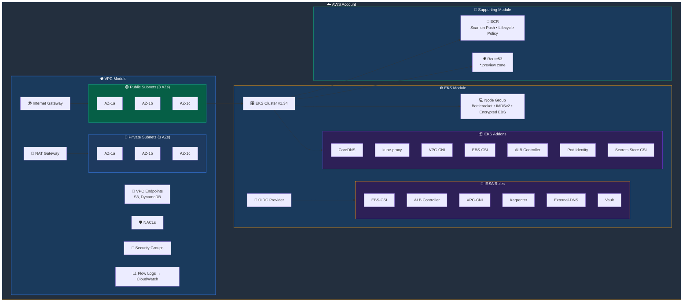
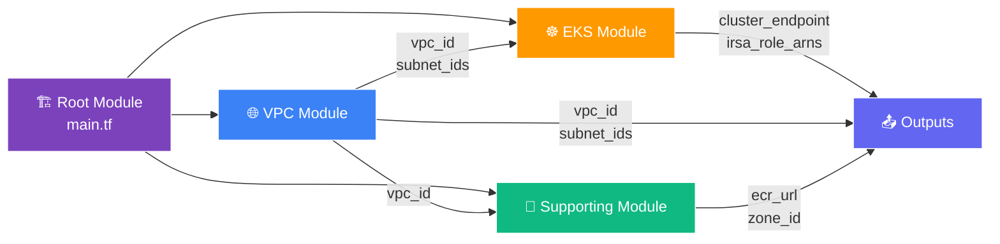

<p align="center">
  
  &nbsp;&nbsp;&nbsp;
  
  &nbsp;&nbsp;&nbsp;
  
</p>

<h1 align="center">🚀 EKS-Infra</h1>

<p align="center">
  <strong>Production-Ready AWS EKS Infrastructure as Code</strong>
</p>

<p align="center">
  
  
  
  
</p>

<p align="center">
  
  
</p>

---

## 📋 Table of Contents

- [🏗️ Architecture](#️-architecture)
- [📁 Folder Structure](#-folder-structure)
- [⚡ Quick Start](#-quick-start)
- [📦 What Gets Created](#-what-gets-created)
- [🔧 Configuration](#-configuration)
- [📤 Outputs](#-outputs)
- [🔒 Security](#-security)

---

## 🏗️ Architecture



### 📐 Module Dependency Flow



---

## 📁 Folder Structure

```
📦 EKS-Infra/
├── 📄 main.tf                         # Root module: wires all child modules
├── 📄 variables.tf                    # Input variables
├── 📄 outputs.tf                      # Exported values
├── 📄 versions.tf                     # Provider version locks
│
├── 📂 modules/
│   ├── 📂 vpc/
│   │   ├── 🌐 main.tf                # VPC, subnets, IGW, route tables
│   │   ├── 🔀 nat.tf                 # NAT Gateway + EIP
│   │   ├── 🔗 endpoints.tf           # VPC Gateway Endpoints
│   │   ├── 📊 flow_logs.tf           # VPC Flow Logs → CloudWatch
│   │   ├── 🛡️ nacl.tf                # Network ACLs
│   │   ├── 🔐 security_group.tf      # ALB + App security groups
│   │   ├── 📄 variables.tf
│   │   └── 📄 outputs.tf
│   │
│   ├── 📂 eks/
│   │   ├── ☸️ main.tf                 # EKS cluster, OIDC, cluster IAM
│   │   ├── 💻 node_groups.tf          # System node group
│   │   ├── 🖥️ launch_template.tf      # IMDSv2, encrypted EBS
│   │   ├── 📦 addons.tf              # EKS managed addons
│   │   ├── 🔑 irsa.tf                # IRSA roles (least-privilege)
│   │   ├── 📄 variables.tf
│   │   └── 📄 outputs.tf
│   │
│   └── 📂 supporting/
│       ├── 🐳 ecr.tf                 # ECR repo + lifecycle policy
│       ├── 🌐 route53.tf             # Hosted zone for ephemeral envs
│       ├── 📄 variables.tf
│       └── 📄 outputs.tf
│
└── 📂 envs/
    ├── 📂 dev/
    │   └── 📄 terraform.tfvars       # Dev config
    └── 📂 prod/
        └── 📄 terraform.tfvars       # Prod config
```

---

## ⚡ Quick Start

### Prerequisites

| Tool | Version | Link |
|------|---------|------|
|  | >= 1.5.0 | [Install](https://developer.hashicorp.com/terraform/install) |
|  | v2 | [Install](https://docs.aws.amazon.com/cli/latest/userguide/getting-started-install.html) |
|  | Latest | [Install](https://kubernetes.io/docs/tasks/tools/) |

### 🚀 Deploy (Clone & Run)

```bash
# 1️⃣ Clone the repo
git clone https://github.com/devops-bootstrap/EKS-Infra.git
cd EKS-Infra

# 2️⃣ Initialize
terraform init

# 3️⃣ Plan
terraform plan -var-file="envs/dev/terraform.tfvars"

# 4️⃣ Apply
terraform apply -var-file="envs/dev/terraform.tfvars"

# 5️⃣ Connect to cluster
aws eks update-kubeconfig --name dev-eks-cluster --region us-east-1
kubectl get nodes
```

### 🚀 Deploy Directly from GitHub (No Clone)

You can reference this repo as a Terraform module directly from GitHub without cloning:

```hcl
module "eks_infra" {
  source = "github.com/devops-bootstrap/EKS-Infra?ref=main"

  region              = "us-east-1"
  environment         = "dev"
  eks_cluster_name    = "dev-eks-cluster"
  eks_cluster_version = "1.34"
  cidr_block          = "10.0.0.0/16"
  private_subnet_cidrs = ["10.0.0.0/19", "10.0.32.0/19", "10.0.64.0/19"]
  public_subnet_cidrs  = ["10.0.96.0/19", "10.0.128.0/19", "10.0.160.0/19"]
}
```

Then run:
```bash
terraform init
terraform apply
```

> 💡 Use `?ref=v1.0.0` to pin to a specific tag/release.

### 🚀 Deploy via GitHub Actions (CI/CD)

Create `.github/workflows/terraform.yml` in your repo:

```yaml
name: Terraform EKS Deploy

on:
  push:
    branches: [main]
  pull_request:
    branches: [main]

env:
  TF_VAR_FILE: envs/dev/terraform.tfvars

jobs:
  terraform:
    runs-on: ubuntu-latest
    steps:
      - uses: actions/checkout@v4

      - uses: hashicorp/setup-terraform@v3
        with:
          terraform_version: 1.5.0

      - name: Configure AWS Credentials
        uses: aws-actions/configure-aws-credentials@v4
        with:
          aws-access-key-id: ${{ secrets.AWS_ACCESS_KEY_ID }}
          aws-secret-access-key: ${{ secrets.AWS_SECRET_ACCESS_KEY }}
          aws-region: us-east-1

      - name: Terraform Init
        run: terraform init

      - name: Terraform Plan
        run: terraform plan -var-file=${{ env.TF_VAR_FILE }}

      - name: Terraform Apply
        if: github.ref == 'refs/heads/main' && github.event_name == 'push'
        run: terraform apply -auto-approve -var-file=${{ env.TF_VAR_FILE }}
```

> ⚠️ Add `AWS_ACCESS_KEY_ID` and `AWS_SECRET_ACCESS_KEY` to your repo's **Settings → Secrets → Actions**. For production, use OIDC with IAM roles instead of static keys.

---

## 📦 What Gets Created

### 🌐 VPC Module

| Resource | Details | Icon |
|----------|---------|------|
| VPC | Single VPC, DNS enabled | 🌐 |
| Public Subnets | 3x across AZs, auto-assign public IP | 🟢 |
| Private Subnets | 3x across AZs | 🔵 |
| Internet Gateway | Public internet access | 🌍 |
| NAT Gateway | Private subnet outbound | 🔀 |
| Route Tables | Public → IGW, Private → NAT | 🗺️ |
| VPC Endpoints | S3, DynamoDB (gateway) | 🔗 |
| Flow Logs | REJECT traffic → CloudWatch | 📊 |
| NACLs | Private + Public rules | 🛡️ |
| Security Groups | ALB (80/443) + App (VPC internal) | 🔐 |

### ☸️ EKS Module

| Resource | Details | Icon |
|----------|---------|------|
| EKS Cluster | v1.34, full control plane logging | 🎛️ |
| OIDC Provider | IRSA support | 🔑 |
| Node Group | On-demand, Bottlerocket, gp3 encrypted | 💻 |
| Launch Template | IMDSv2 enforced, hop limit 1 | 🖥️ |
| CoreDNS | Cluster DNS resolution | 📦 |
| kube-proxy | Network proxy | 📦 |
| VPC-CNI | Pod networking + IRSA | 📦 |
| EBS-CSI | Persistent volumes + IRSA | 📦 |
| ALB Controller | Ingress/LB management + IRSA | 📦 |
| Pod Identity Agent | EKS Pod Identity | 📦 |
| Secrets Store CSI | AWS Secrets Manager | 📦 |

### 🧩 Supporting Module

| Resource | Details | Icon |
|----------|---------|------|
| ECR Repository | Scan on push, keep last 30 images | 🐳 |
| Route53 Zone | `*.preview.<env>.test.io` | 🌐 |

---

## 🔧 Configuration

### Environment Comparison

| Setting | 🧪 Dev | 🏭 Prod |
|---------|--------|---------|
| Cluster Name | `dev-eks-cluster` | `prod-eks-cluster` |
| Instance Type | `t3.medium` | `m5.large` |
| Node Count | 3–5 | 3–10 |
| Public API | ✅ Enabled | ❌ Disabled |
| VPC CIDR | `10.0.0.0/16` | `10.1.0.0/16` |

### Input Variables

| Variable | Type | Default | Description |
|----------|------|---------|-------------|
| `region` | `string` | `us-east-1` | AWS region |
| `environment` | `string` | `dev` | Environment name |
| `eks_cluster_name` | `string` | `my-eks-cluster` | Cluster name |
| `eks_cluster_version` | `string` | `1.34` | K8s version |
| `cidr_block` | `string` | `10.0.0.0/16` | VPC CIDR |
| `private_subnet_cidrs` | `list(string)` | 3x /19 | Private CIDRs |
| `public_subnet_cidrs` | `list(string)` | 3x /19 | Public CIDRs |
| `eks_node_group_ami_type` | `string` | `BOTTLEROCKET_x86_64` | Node AMI |
| `eks_node_group_instance_types` | `list(string)` | `["t3.medium"]` | Instance types |
| `eks_node_group_desired_size` | `number` | `3` | Desired nodes |
| `eks_node_group_min_size` | `number` | `3` | Min nodes |
| `eks_node_group_max_size` | `number` | `5` | Max nodes |
| `vpc_endpoint_services` | `list(string)` | S3, DynamoDB | VPC endpoints |
| `addon_versions` | `object` | `null` | Override addon versions |

---

## 📤 Outputs

| Output | Description |
|--------|-------------|
| `vpc_id` | 🌐 VPC ID |
| `private_subnet_ids` | 🔵 Private subnet IDs |
| `public_subnet_ids` | 🟢 Public subnet IDs |
| `cluster_id` | ☸️ EKS cluster ID |
| `cluster_endpoint` | 🔗 EKS API server endpoint |
| `cluster_certificate_authority_data` | 🔐 Base64 CA cert |
| `cluster_oidc_issuer_url` | 🔑 OIDC issuer for IRSA |
| `irsa_role_arns` | 🎭 Map of IRSA role ARNs |

---

## 🔒 Security

<p align="center">
  
  
  
  
</p>

| Feature | Status | Details |
|---------|--------|---------|
| 🖥️ IMDSv2 | ✅ Enforced | Hop limit = 1, tokens required |
| 💾 EBS Encryption | ✅ Enabled | gp3, AWS default KMS |
| 🐧 Node OS | ✅ Bottlerocket | Minimal attack surface, immutable |
| 📊 Flow Logs | ✅ Enabled | REJECT traffic → CloudWatch |
| 🛡️ NACLs | ✅ Configured | Public + Private subnets |
| 🔑 IRSA | ✅ Least-privilege | One role per controller |
| 🐳 ECR Scanning | ✅ On push | Vulnerability detection |
| 📝 Control Plane Logs | ✅ All enabled | api, audit, authenticator, controller, scheduler |
| 🔒 Private Endpoint | ✅ Prod only | Public disabled in production |

---

## 🤝 Contributing

1. Create a feature branch from `develop`
2. Make changes
3. Run `terraform fmt` and `terraform validate`
4. Open a Pull Request

---

<p align="center">
  <sub>Built with ❤️ using Terraform & AWS EKS</sub>
</p>
